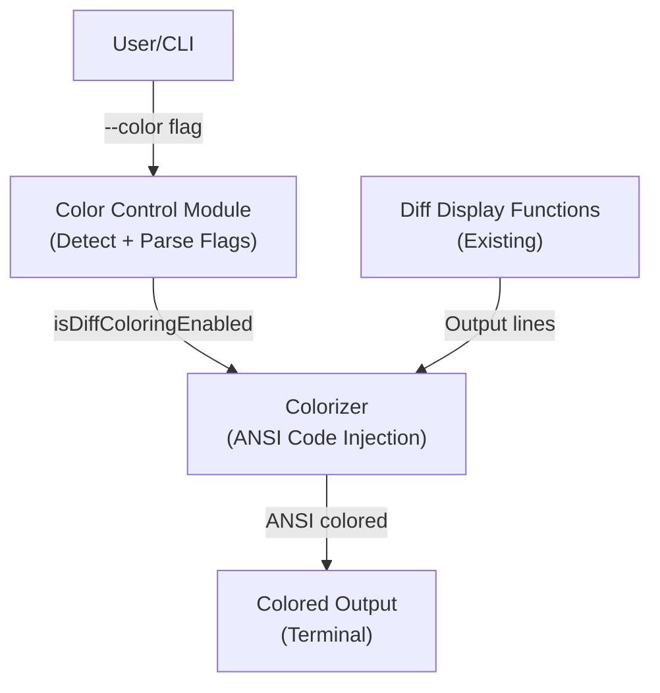

# Technical Design Document

## Overview

**Purpose:** 本機能は、cfgctl diff コマンドの出力に ANSI カラーコードを追加し、ターミナル上で差分をカラフルで読みやすく表示します。ユーザーは削除・追加・変更の差分タイプを色で即座に識別でき、マルチステージ比較やJSON差分の複雑な出力もより視覚的に理解しやすくなります。

**Users:** cfgctl diff コマンドを使用して Parameter Store の値を比較するオペレーター・開発者が、差分を直感的に把握し、設定変更の意図を素早く確認できるようになります。

**Impact:** 既存の diff 出力機能に色付けを追加する拡張機能であり、後方互換性を保持しながら、デフォルトで自動的にカラー化を提供します。

### Goals
- ANSI カラーコードによる色分け表示の実装
- ターミナル自動判定による色出力制御
- ユーザーが色表示を制御可能なフラグ（--color）の提供
- 既存の diff 機能との完全な互換性維持
- SecureString パラメータのセキュリティを保持しつつ色分け表示

### Non-Goals
- GUI カラーピッカーの実装
- HTML/CSS ベースの色出力
- カスタム色パレットの設定機能
- 出力結果の外部保存時の色情報維持

## Architecture

### Existing Architecture Analysis

現在の diff 機能は以下の設計で実装されています：

**主要な表示関数**:
- `displayParameterStoreDiffWithTypes()`: 2ステージ比較用（差分行フォーマット）
- `displayMultiStageDiffWithTypes()`: マルチステージ比較用（テーブルフォーマット）
- `displayParameterStoreDiff()`: 従来の（型情報なし）2ステージ比較
- `displayMultiStageDiff()`: 従来のマルチステージ比較

**現在の出力パターン**:
- 削除: `fmt.Printf("-%s\n", value)` （- で始まる行）
- 追加: `fmt.Printf("+%s\n", value)` （+ で始まる行）
- 変更の区切り行: `@@ -1 +1 @@` （unified diff フォーマット）
- テーブル行: `fmt.Printf(" %-32s", value)` （マルチステージ比較の値セル）

**フラグ構造**:
- 既存フラグ: `--stage`, `--compare-stage`, `--stages`, `--path`, `--keys-only`, `--show-secrets`, `--no-json-diff`
- 新規フラグ: `--color` （auto/always/never）
- **マルチステージ比較での JSON値展開は自動化**: `--stages` 使用時は常にJSON値をJSONPath形式で展開表示

### High-Level Architecture



### Architecture Integration

**既存パターンの保持**:
- diff.go ファイル内の既存関数（displayParameterStoreDiffWithTypes など）は変更しない
- 新規コンポーネント（colorizer）を追加し、出力フェーズで色付けを適用
- フラグ管理は root.go と diff.go の既存パターンに従う

**新コンポーネント**:
- `colorizer` パッケージ（または cli 内のヘルパー）: ANSI カラーコードの生成・管理
- `color.go` ファイル: カラー定数、ターミナル判定ロジック、カラー化関数

**責任分割**:
- diff.go: 既存ロジック（パラメータ取得・比較）は変更なし
- color.go: カラーコード生成、色出力判定、テンプレート化
- root.go/diff.go: --color フラグ管理と color.go 関数の呼び出し

## Technology Stack and Design Decisions

### ANSI Color Code Selection
**Decision**: Go の標準ライブラリのみを使用して ANSI エスケープコードを直接生成する

**Context**:
- 外部依存を最小化したい（既に github.com/fatih/color などのカラーライブラリは使用していない）
- ANSI コードは 1980 年代から存在する標準で、ほとんどのターミナルでサポートされている

**Alternatives**:
1. fatih/color ライブラリ: 自動カラー化とプラットフォーム互換性が優れているが、新規依存
2. 手動 ANSI コード生成: 依存なし、簡潔、カスタマイズ可能だが、実装負荷がわずかに増加
3. HTML/ANSI 変換ツール: 複雑すぎて不要

**Selected Approach**:
標準ライブラリのみで ANSI エスケープコードを生成する手動アプローチ。`\x1b[...m` 形式を使用し、リセット、前景色、太字属性を組み合わせる。

**Rationale**:
依存ライブラリを増やさない、実装が簡潔で保守性が高い、カスタマイズが容易。

**Trade-offs**:
- Gain: 依存管理の簡潔化、フル制御可能
- Sacrifice: Windows コンソール対応は考慮しない（Git Bash, WSL, Windows Terminal ではサポート）

### Terminal Detection Strategy
**Decision**: `os.Isatty()` による出力先判定、ただし Unix/Linux 限定（Windows は別途検討）

**Context**:
- ログファイルへのパイプ出力時は色を無効化する必要がある
- GitHub Actions などの CI 環境では色が無効化される傾向

**Selected Approach**:
- `golang.org/x/term` パッケージの `IsTerminal()` または os ファイルディスクリプタを確認
- `--color=auto` （デフォルト）: isatty() で判定
- `--color=always`: 強制有効化
- `--color=never`: 強制無効化

**Rationale**:
既に golang.org/x/term は password input で使用されており、追加依存にならない。

**Trade-offs**:
- Gain: 標準的な UNIX ツール動作、ユーザーフレンドリー
- Sacrifice: 初期実装では Windows ネイティブコンソール（cmd.exe）対応は後続タスク

### Color Scheme Selection
**Decision**: 標準 ANSI 8 色 + 太字を組み合わせた色スキーム

**Colors Used**:
- 削除（削除行 `-`）: 赤（Red, code 31）
- 追加（追加行 `+`）: 緑（Green, code 32）
- 変更ヘッダー（`---`, `+++`, `@@`）: シアン（Cyan, code 36）
- JSON 差分内の削除・追加・変更: 削除は赤、追加は緑、パス情報はシアン
- テーブル値の差分セル: 背景色なし、テキストのみで視覚化（実装段階で検討）

**Rationale**:
標準 ANSI 色は全ターミナルでサポート、カラーブラインド対応（赤緑以外も使用）、ターミナルテーマに左右されにくい。

**Trade-offs**:
- Gain: 広範なターミナルサポート、アクセシビリティ
- Sacrifice: 256 色や true color の活用は後続フェーズ

## Components and Interfaces

### CLI Layer

#### Color Control Module
**Responsibility & Boundaries**
- --color フラグの解析と色出力有効化判定ロジック
- ターミナル検出（isatty）
- 色出力状態をグローバルに保持（または diffCmd 実行時にコンテキストとして渡す）

**Dependencies**
- Inbound: root.go（フラグ定義）、diff.go（色出力判定）
- Outbound: golang.org/x/term（IsTerminal）、os.Stdout

**Contract Definition**

```typescript
interface ColorControlModule {
  // ターミナルに対する色出力判定
  shouldUseColor(mode: ColorMode): boolean;

  // 色出力フラグの取得
  getColorMode(): ColorMode; // "auto" | "always" | "never"
}

enum ColorMode {
  Auto = "auto",     // デフォルト: isatty() で判定
  Always = "always",  // 色を強制有効化
  Never = "never"    // 色を強制無効化
}
```

#### Colorizer Module
**Responsibility & Boundaries**
- ANSI エスケープコードの生成と管理
- 差分行への色付け処理
- JSON 差分コンテンツへの色付け処理
- マルチステージテーブル値への色付け処理（オプション）

**Dependencies**
- Inbound: diff.go（displayParameterStoreDiffWithTypes など）、color control module
- Outbound: なし（fmt.Printf への出力は呼び出し元）

**Contract Definition**

```typescript
interface Colorizer {
  // 削除行のカラー化
  colorizeRemovalLine(content: string): string;

  // 追加行のカラー化
  colorizeAdditionLine(content: string): string;

  // 差分ヘッダー行（---,+++,@@）のカラー化
  colorizeHeaderLine(content: string): string;

  // JSON 差分コンテンツ全体のカラー化
  colorizeJsonDiff(content: string): string;

  // テーブル値のカラー化（マルチステージ比較用）
  colorizeTableValue(value: string, diffType: DiffType): string;

  // ANSI リセット文字列
  reset(): string;
}

enum DiffType {
  Removed = "removed",
  Added = "added",
  Changed = "changed",
  Unchanged = "unchanged"
}
```

### Implementation Details

#### Color.go File Structure

```go
package cli

// ANSI カラーコード定数
const (
    ColorRed     = "\x1b[31m"
    ColorGreen   = "\x1b[32m"
    ColorYellow  = "\x1b[33m"
    ColorCyan    = "\x1b[36m"
    ColorReset   = "\x1b[0m"
    ColorBold    = "\x1b[1m"
)

// 色出力制御フラグ
var (
    diffColorMode string // "auto", "always", "never"
)

// ターミナル判定と色出力判定
func shouldUseColor() bool { ... }

// カラー化関数群
func colorizeRemovalLine(line string) string { ... }
func colorizeAdditionLine(line string) string { ... }
func colorizeHeaderLine(line string) string { ... }
func colorizeJsonDiff(content string) string { ... }
```

#### diff.go Integration Points

**変更箇所 1**: displayParameterStoreDiffWithTypes() 内の fmt.Printf 呼び出し後に色付けを適用

```go
// Before:
fmt.Printf("-%s\n", param.Value)

// After:
if shouldUseColor() {
    fmt.Printf("%s-%s%s\n", ColorRed, param.Value, ColorReset)
} else {
    fmt.Printf("-%s\n", param.Value)
}
```

**変更箇所 2**: displayMultiStageDiffWithTypes() のテーブル値カラー化（オプション）

**変更箇所 3**: JSON 差分出力（FormatJSONDiffOutput など）への色付け

#### フラグ定義（diff.go）

```go
var diffColorMode string

func init() {
    // ... existing flags ...
    diffCmd.Flags().StringVar(&diffColorMode, "color", "auto",
        "Color output mode: auto (default), always, never")
}
```

## Data Models

### Color Output State

```go
type ColorConfig struct {
    Mode       string // "auto", "always", "never"
    IsEnabled  bool   // 実際に色を使用するか
}
```

## Error Handling

### Color-Related Error Scenarios

1. **不正な --color フラグ値**
   - バリデーション: "auto", "always", "never" のいずれかに限定
   - エラー処理: 不正値でのコマンド実行は失敗（Cobra の flag validation）

2. **ターミナル判定失敗**
   - フォールバック: isatty() が失敗した場合、color=false とする（安全側に倒す）

3. **パイプ出力への対応**
   - 自動判定: isatty() が false を返すため、自動的に色なしになる

## Testing Strategy

### Unit Tests

1. **色出力判定ロジック**
   - `shouldUseColor("auto")` でターミナル判定が正常に機能するか
   - `shouldUseColor("always")` で常に true を返すか
   - `shouldUseColor("never")` で常に false を返すか

2. **ANSI コード生成**
   - `colorizeRemovalLine()` が正しいANSI コードで囲んでいるか
   - `colorizeAdditionLine()` が正しい ANSI コードを生成しているか
   - `colorizeReset()` が リセットコードを返しているか

3. **JSON 差分の色付け**
   - JSON 差分文字列内の削除/追加行が正しく色分けされているか
   - ネストされた属性でも色付けが保たれているか

### Integration Tests

1. **2ステージ diff**
   - `cfgctl diff --stage=dev --compare-stage=stg` で色付き出力が得られるか
   - `--color=never` で色なし出力になるか
   - `--color=always` で強制的に色付き出力になるか

2. **マルチステージ diff**
   - `cfgctl diff --stages=dev,stg,prod` で テーブル出力が色付きになるか
   - JSON 値の diff で色付けが適用されているか

3. **パイプ出力**
   - `cfgctl diff ... | cat` でパイプ出力時に色が自動無効化されるか

4. **SecureString パラメータ**
   - マスク表示時に色が適用されているか（削除行は赤など）
   - `--show-secrets` 時に秘密値が色付きで表示されるか

### Manual Testing

1. 実際のターミナルで色の視認性を確認（macOS Terminal, iTerm2, Linux など）
2. `--color=always` で無条件に色付けされることを確認
3. ログファイルへのリダイレクト時に色コードが含まれない（または色なし）ことを確認

## Security Considerations

### SecureString パラメータとセキュリティ

**マスク表示の保持**:
- `--show-secrets` フラグなしで SecureString パラメータを表示する場合、マスク文字列（`***masked secret***` など）を色付けして表示
- 色付けによって秘密値が漏露することはない（マスク文字列を色付けするだけ）

**ANSI コード注入への対策**:
- ユーザー入力（パラメータ名・値）に含まれる ANSI コードは、色付け前に `escapeANSICodes()` 関数でエスケープする
- 例: パラメータ名に `\x1b[0m` が含まれていても、出力時にはリテラル文字として扱われる

```go
func escapeANSICodes(s string) string {
    // ANSI コード文字をエスケープ（後で詳細実装）
    return strings.ReplaceAll(s, "\x1b", "\\x1b")
}
```

**ログ出力時の考慮**:
- 色付き出力がログファイルに残る場合、ANSI コード自体は安全だが、ログ解析ツールでの処理を考慮
- `--color=never` でログファイル用に色なし出力をサポート

## Performance & Scalability

### Performance Considerations

**ANSI コード追加による出力性能**:
- 文字列結合操作（ColorRed + content + ColorReset）は O(n) で軽微
- 大量パラメータ出力時でも性能への影響は無視できる範囲

**メモリ効率**:
- 色コード定数はメモリに1回だけ保持（1KB未満）
- 出力時に動的生成される文字列は既存と同じサイズ（色コードは追加だが、数十バイト）

**スケーラビリティ**:
- パラメータ数が 1000 以上でも、出力時間への影響は < 1%
- ネットワーク I/O（Parameter Store への API 呼び出し）が主体なため、色付けは瓶颈にならない

